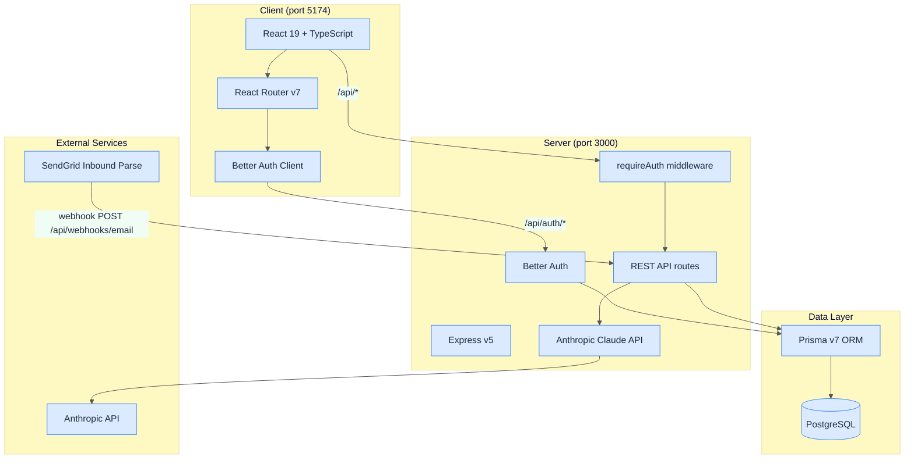
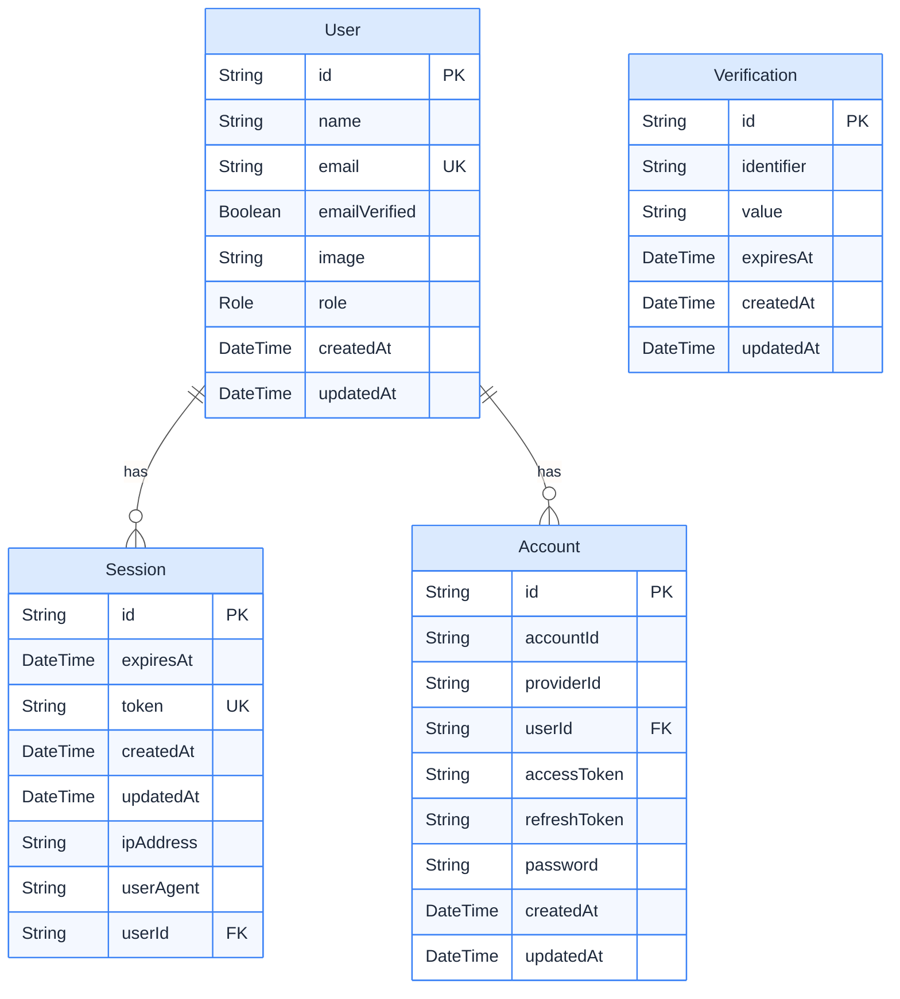
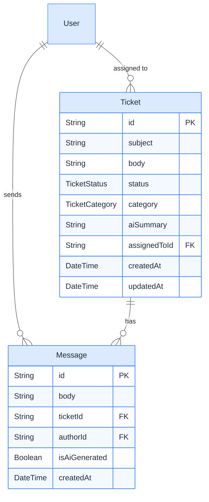
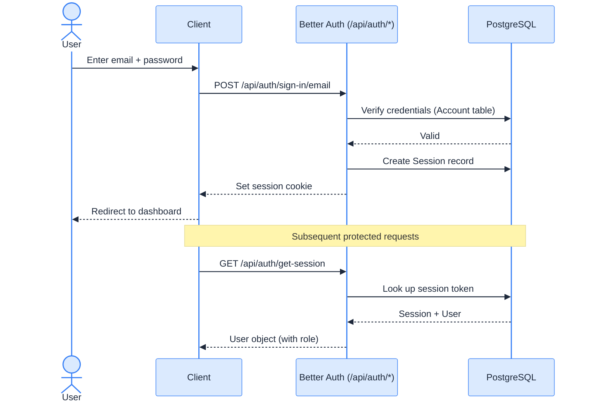
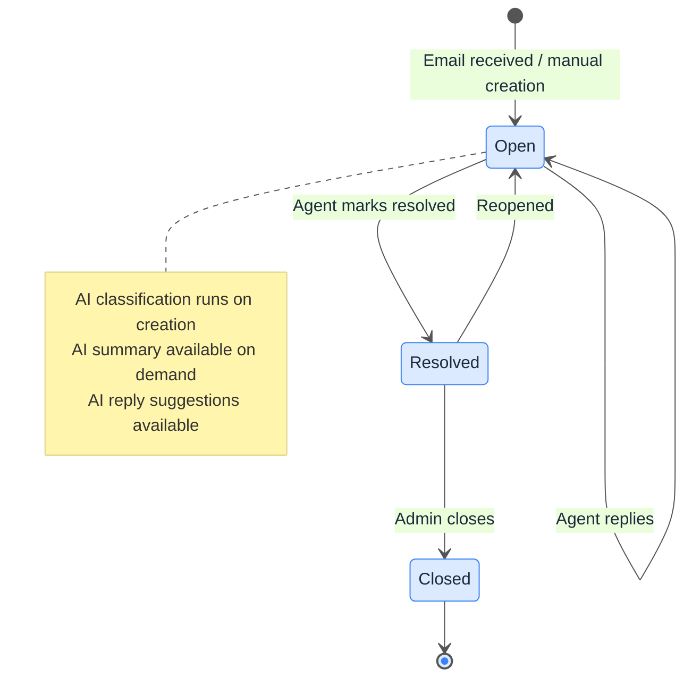
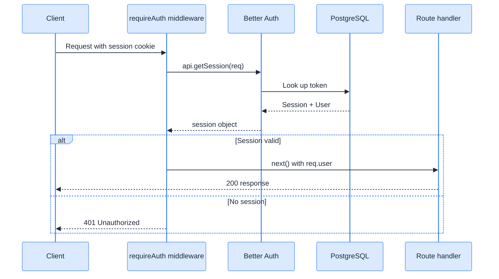

# Diagrams

## 1. System Architecture

---

## 2. Database Schema (Current)

---

## 3. Planned Schema (Phase 3+)

---

## 4. Authentication Flow

---

## 5. Ticket Lifecycle

---

## 6. Request Flow (Protected API)

